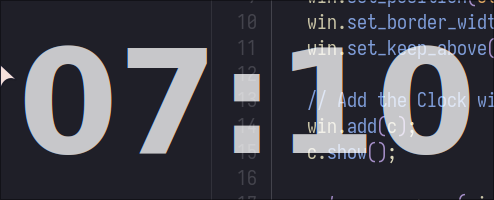

# Focus Clock

Bigass clock that sits on top of all windows to help you focus.



## Install

Arch Linux users can install the package from the AUR:

```sh
yay -S focusclock-git
```

Or you can build it from source

## Building

Requires Gtkmm4, gtk4-layer-shell, CMake, pkg-config.

```
mkdir build
cd build
cmake ..
make
```

You might also wanna add the keybinds like the following in your Hyprland config
to your wm or similar:

```
bind = $mainMod ALT, M, exec, killall -SIGTERM focusclock || focusclock -br -B 70
```

## Usage

You can configure the position of the clock using the following command-line
options:

```sh
Usage:
  focusclock [OPTION?]

Help Options:
  -h, --help              Show help options

Application Options:
  -v, --version           Show version information
  -t, --anchor-top        Anchor to the top edge
  -b, --anchor-bottom     Anchor to the bottom edge
  -l, --anchor-left       Anchor to the left edge
  -r, --anchor-right      Anchor to the right edge
  -T, --margin-top        Margin from the top edge
  -B, --margin-bottom     Margin from the bottom edge
  -L, --margin-left       Margin from the left edge
  -R, --margin-right      Margin from the right edge
  -f, --font-size         Base font size
  -c, --color             Text color (hex format: RGB, RGBA, RRGGBB, or RRGGBBAA)
  -F, --font-family       Font family name
  -a, --alpha             Text opacity (0.0-1.0, overridden by RGBA color)
  -y, --layer             GTK shell layer (0=background, 1=bottom, 2=top, 3=overlay, 4=no_layer)


```

# References

- https://github.com/nwg-piotr/nwg-wrapper/
- https://github.com/wmww/gtk4-layer-shell/
- https://www.gtk.org/docs/language-bindings/cpp

## License

GNU GPL3+
