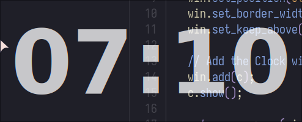

# Focus Clock

Bigass clock that sits on top of all windows to help you focus.



## Install

Arch Linux users can install the package from the AUR:

```sh
yay -S focusclock-git
```

macOS users can install it with Homebrew:

```sh
brew install korigamik/tap/focusclock
```

Prebuilt Linux (x86_64) and universal macOS binaries are attached to each
[GitHub release](https://github.com/KorigamiK/focusclock/releases).

Or you can build it from source

## Building

Focus Clock is a small native app on each platform:

- **Linux**: a Wayland layer-shell surface drawn with Cairo. Needs a compositor
  that supports `wlr-layer-shell` (Hyprland, Sway, river, niri, KDE Plasma,
  ...). Build dependencies: CMake, pkg-config, `wayland`, `wayland-protocols`
  and `cairo`.
- **macOS**: a Cocoa overlay drawn with Core Text. It floats above all windows
  and fullscreen apps on every Space, ignores the mouse and has no Dock icon.
  Only CMake and the Xcode Command Line Tools are needed.

```
cmake -S . -B build -DCMAKE_BUILD_TYPE=Release
cmake --build build
sudo cmake --install build
```

You might also wanna add the keybinds like the following in your Hyprland config
to your wm or similar:

```
bind = $mainMod ALT, M, exec, killall -SIGTERM focusclock || focusclock -br -B 70
```

## Usage

You can configure the position of the clock using the following command-line
options:

```sh
Usage:
  focusclock [OPTION?]

Options:
  -h, --help              Show help options
  -v, --version           Show version information
  -t, --anchor-top        Anchor to the top edge
  -b, --anchor-bottom     Anchor to the bottom edge
  -l, --anchor-left       Anchor to the left edge
  -r, --anchor-right      Anchor to the right edge
  -T, --margin-top        Margin from the top edge
  -B, --margin-bottom     Margin from the bottom edge
  -L, --margin-left       Margin from the left edge
  -R, --margin-right      Margin from the right edge
  -f, --font-size         Base font size
  -c, --color             Text color (hex format: RGB, RGBA, RRGGBB, or RRGGBBAA)
  -F, --font-family       Font family name
  -a, --alpha             Text opacity (0.0-1.0, overridden by RGBA color)
  -y, --layer             Layer (0=background, 1=bottom, 2=top, 3=overlay)
```

Anchoring one edge pins the clock to it (plus the margin); anchoring both
opposite edges, or neither, centers it on that axis. On macOS `--layer` maps
to window levels (desktop, normal, floating, overlay).

## Changelog

See [CHANGELOG.md](CHANGELOG.md) for a list of changes.

# References

- https://github.com/nwg-piotr/nwg-wrapper/
- https://wayland.app/protocols/wlr-layer-shell-unstable-v1

## License

GNU GPL3+
